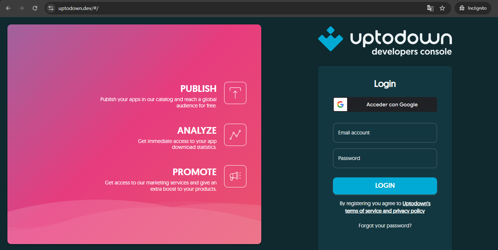
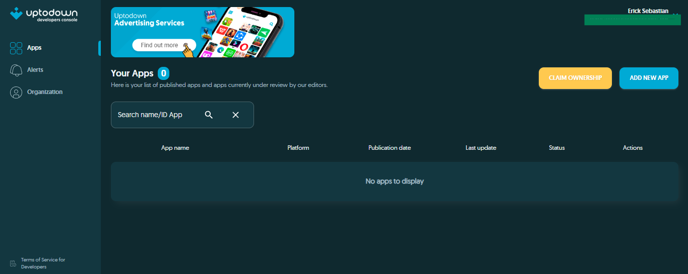
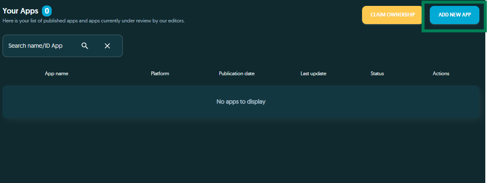
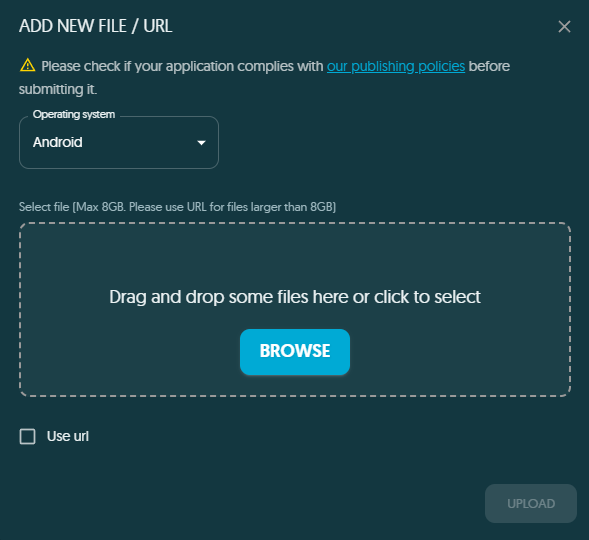
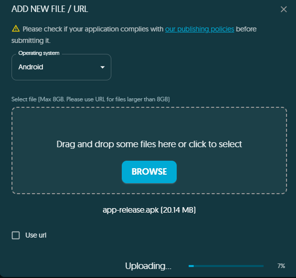
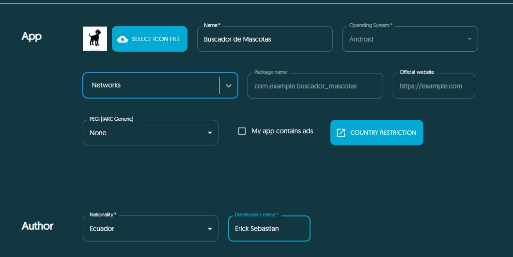
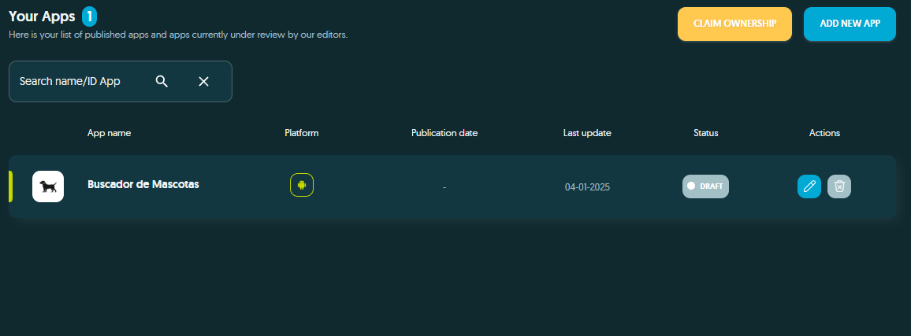

# Dog API Flutter App

Este proyecto es una aplicación en Flutter que permite buscar imágenes de perros según su raza. Utiliza la API de [Dog CEO](https://dog.ceo/dog-api/) para obtener las razas de perros y sus imágenes aleatorias.

## Características

- Muestra una lista desplegable con las razas de perros.
- Permite seleccionar una raza y mostrar una imagen aleatoria del perro seleccionado.
- Maneja errores al cargar las imágenes y muestra un mensaje adecuado si no se puede obtener la imagen.

## Actividades

### Actividad 1: Obtener una imagen de un perro por raza

Se utiliza el endpoint de la API de Dog CEO para obtener una imagen aleatoria de un perro según la raza seleccionada. Se muestra la imagen en la interfaz de usuario.

- **Endpoint para obtener la imagen aleatoria de un perro por raza**:
https://dog.ceo/api/breed/<raza>/images/random

markdown
Copiar código
Donde `<raza>` es el nombre de la raza seleccionada.

### Actividad 2: Listar todas las razas de perros

La aplicación realiza una llamada a la API para obtener la lista de todas las razas de perros y mostrarlas en un menú desplegable.

- **Endpoint para obtener la lista de razas**:
https://dog.ceo/api/breeds/list/all

### Subir la aplicación a UpToDown
1. Se debe crear una cuenta como desarrollador en [UPTODOWN CONSOLE](https://www.uptodown.dev/#/)

2. Una vez creada la cuenta como desarrollador , te aparecerá la siguiente ventana

3. Da clic en "Subir App"

4. Se te apertura una ventana emergente donde colocarás el nombre de la aplicación y el .apk

5. Se debe esperar a que se suba la aplicación

6. Una vez se cargue completamente la aplicación , se solicitará información referente a la aplicación : versiones , idioma  capturas de la aplicación , etc.

7. Por último se guarda cambios y se espera a la revisión por parte de la plataforma

## Autor
Erick Caiza